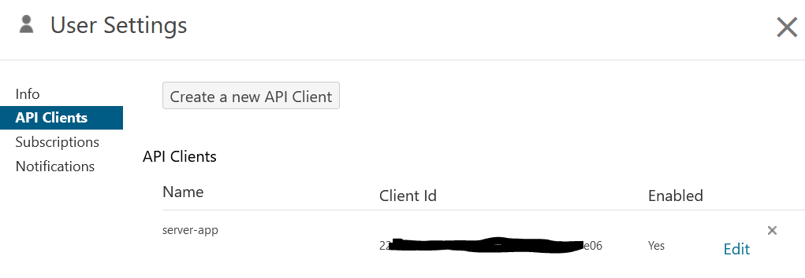

# LibGuides Learning Objects

Invalid Date

This repo has been retired here and is now at
<https://github.com/UniSotonLibrary/libguides-learning-objects>

This repository contains the python code and yaml workflow for collating
information about the learning objects (LOs) hosted on the University of
Southampton LibGuides pages.

There are three python scripts:

- `panopto-client.py` and `panopto_oauth2.py` are used to access a
  Panopto API client and creates the `panopto_recordings.csv` file
  listing recordings from the LIBSKILLS Panopoto folder to the `reports`
  folder. This has to be run locally and isn’t part of the automated
  Github Action.

- `learning-object-data.py` downloads the latest
  `check-links-report.csv` data from the [link crawler
  repo](https://github.com/UniSotonLibrary/link-crawler) to the
  `reports` folder. It wrangles the `check-links-report.csv` data along
  with the `panopto_recordings.csv` to extract learning object links and
  locations for Articulate, Thinglink, Wordpress, Panopto and Powtoon.
  It outputs three `csv` files to the `tables` folder.

## Github Actions and Pages

`libguides-learning-objects.yaml` in `.github/workflows` is the Github
Actions set to run monthly on the 16th of each month. It runs
`learning-object-data.py` and then uses `index.html` to publish a Github
Page from the tables in `tables` folder that summarise the learning
object information.

The page displays a summary of the number of each learning object and
one can view two tables:

1.  All Learning Objects shows all LO types found on LibGuides as per
    the summary above using the link crawler
2.  Panopto just shows the Panopto LOs that are in the LIBSKILLS folder
    and also on LibGuides

The table displays these columns:

- Name of the Panopto recording or the Learning Object Type depending on
  which table is selected.
- URL is the URL of the learning object.
- Status Code is the HTTP status code of the checked link.
- Status Emoji is a visual indicator of the status code: 💙 for 200 OK,
  💔 for 404 broken, 😕 for any other status.
- Page Found On is the webpage on which the learning object is linked or
  embedded.

The table can be filteted using the search box and download either the
filtered or unfiltered data as a CSV file.

It also sends an email notification that the page has been updated with
the latest information.

The workflow uses the following secrets in the GitHub repository:

- `GMAIL_USERNAME`: Gmail address used for email notification
- `GMAIL_PASSWORD`: App Password for email notification. See [Create App
  passwords](https://knowledge.workspace.google.com/kb/how-to-create-app-passwords-000009237)
- `LIB_EMAIL_RECIPIENT`: Primary email recipient
- `EMAIL_RECIPIENT`: CC email recipient (if desired)

## Panopto API

The Panopto API client requires you to created a Server Side Web
Application that is configured with client ID and client secret.

You can create the client in your Panopto User Settings:



Then configure the Server Side Web Application:


And then store the client ID and client secret locally in a `.env` file:

``` bash
export CLIENT_ID="your-client-id"
export CLIENT_SECRET="your-client-secret"
```

These are used by the `panopto_oauth2.py` file. The folder id for
LIBSKILLS is in the `panopto-client.py` file and once you’ve sourced the
`.env` file you can run the `panopto-client.py` file to create the
`panopto_recordings.csv` file.
